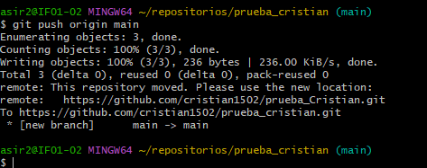

# Prueba de github y markdown

###### Esto es una prueba


El hotel del centro es el **más antiguo** del pueblo y también es aquel que tiene más comodidades. Este hotel fue construido en 1911, pero primero se utilizó como casa de familia. ***En 1975 un inversionista compró esta propiedad y la reformó*** para transformarla en el hotel que hoy conocemos. *Es un hotel pequeño*, pero cuenta con servicio a la habitación, con pileta climatizada, con un restaurante de categoría, entre otras cosas.
----
 ### Esto es un cacho de codigo
 ```
{
  "firstName": "Cristian",
  "lastName": "Saiz",
  "age": 21
}
```

### lista ordenada
1. huevos
2. leche
3. pan

### lista desordenada
* pan
* leche
* huevos

[enlace externo](https://www.google.es)

[enlace a un archivo](D:\Usuarios\asir2\repositorios\prueba_cristian\taller4.md)
## una imagen


## una tabla

| nombre | Apellido |
| ----------- | ----------- |
| Cristian | Saiz |
| Hugo | Calvo |