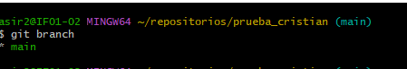
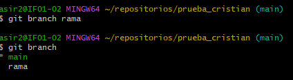
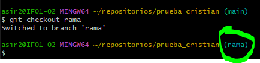
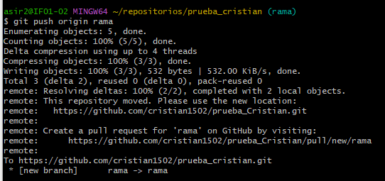
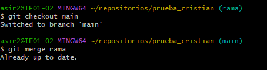

    ## Ramas de github
 1. Comprobar las ramas que tenemos  

2. Creo una rama  

3. Cambiamos a esa rama  

4. Ahora creo la rama en github  
 
5. Incorporamos los cambios a la rama principal  
 

