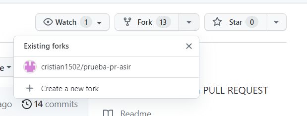
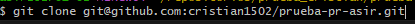
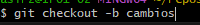
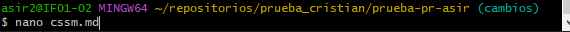
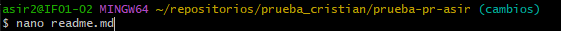
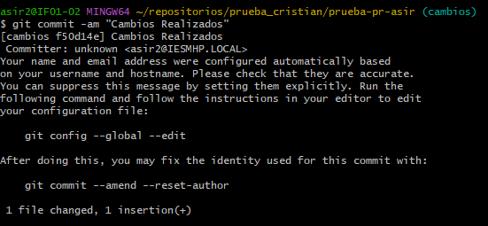
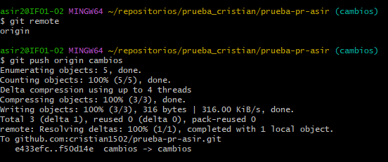
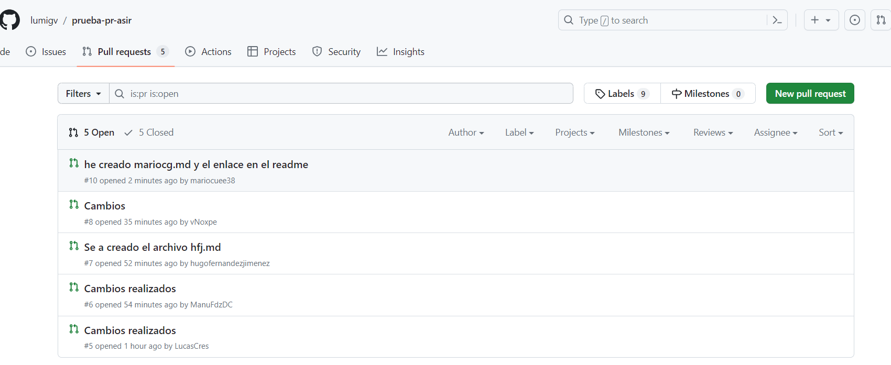

## Como realizar un pull request
1. Hacemos un fork  

2. Hacemos un git clone del repositorio al que previamente hemos hecho un fork  

3. Una vez lo tenemos hacemos una nueva rama 

4. Ahora creamos el fichero con tus iniciales y modificamos tambien el readme

5. Ahora guardamos los cambios 

6. Y lo subimos

7. Por ultimo confirmamos ese pull request y ya estaría

